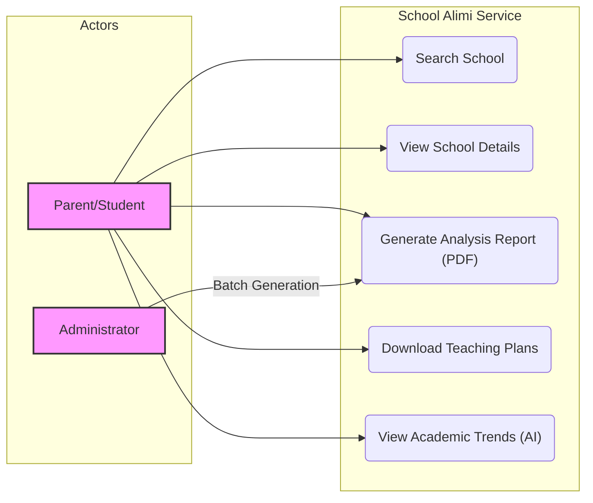
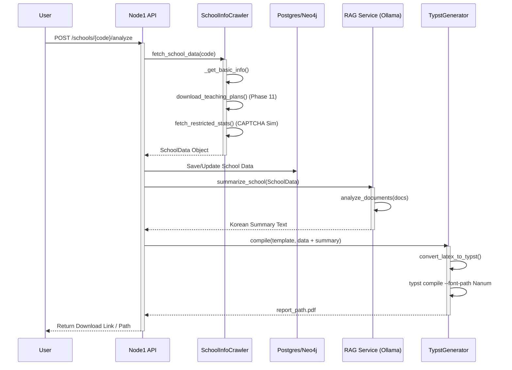
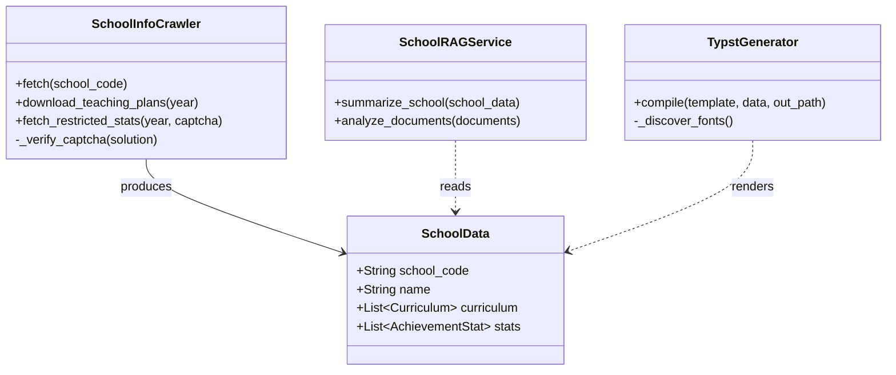

# School Info Service UML Diagrams

## 1. Use Case Diagram
This diagram illustrates how users interact with the School Info Service.

## 2. Sequence Diagram (Report Generation)
This diagram details the flow from the user request to the final generated PDF report.

## 3. Class Diagram (Core Components)
Structure of the key classes implementing specific crawler and analysis logic.

